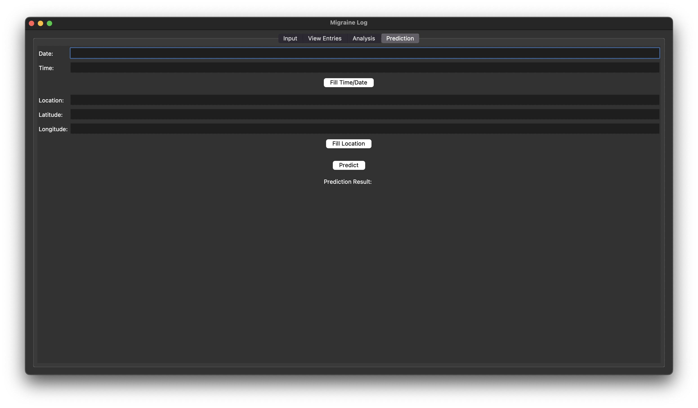

# Migraine Navigator

Migraine Navigator is a comprehensive tool designed to help users both **track** and **predict** migraine occurrences. By combining detailed logging of migraine episodes with advanced machine learning models, this project empowers users to better understand their migraine patterns and anticipate future episodes.

> **Disclaimer:** This software and its outputs are for informational and educational purposes only and are not intended to diagnose, treat, cure, or prevent any disease. Always consult a qualified healthcare provider for medical advice.

## Features

- **Migraine Tracking:** Log migraine events, symptoms, triggers, medications, and weather data.
- **Migraine Prediction:** Predict the likelihood of future migraine episodes using state-of-the-art machine learning and ensemble models.
- **Data Visualization:** Visualize trends and patterns in your migraine history.
- **Customizable Analysis:** Integrate your own data and adjust model parameters for personalized insights.

## Requirements

Install dependencies with:

```bash
pip install -r requirements.txt
```

Main dependencies:
- pandas
- numpy
- matplotlib
- seaborn
- scikit-learn
- imbalanced-learn
- xgboost
- tensorflow
- meteostat
- geocoder
- pytz

Some models and notebooks require:
- imbalanced-learn (for SMOTE and ensemble methods)
- xgboost (for XGBoost models)

## Usage

1. **Run the Application**: Execute the `main.py` file to start the application.

```sh
python main.py
```

2. **Input Data**: Use the "Input" tab to enter migraine instance details. Click the "Save Entry" button to save the data. The Github repository includes anonymized, synthetic data (data/synthetic_migraine_log.csv) for demonstration purposes.

3. **View Entries**: Switch to the "View Entries" tab to see the logged entries in a table.

4. **Analyze Data**: Go to the "Analysis" tab to perform graphical analysis on the migraine data. Select the type of graph you want to display and click the "Analyze" button.

5. **Predict Migraines**: Use the "Prediction" tab to predict the likelihood of a migraine based on the input data and current weather conditions. Click the "Predict" button to see the prediction result.

## File Structure

```
Migraine Navigator/
├── analysis/                # Analysis modules
├── data/                    # Data files (CSV, weather, logs)
├── data_import_helpers/     # Scripts for data import/cleaning
├── dummy_logs/              # Example migraine logs
├── input/                   # Input frame modules
├── models/                  # Saved model files (e.g., .pkl)
├── notebooks/               # Jupyter notebooks for modeling
├── prediction/              # Prediction and ML code
├── screenshots/             # UI screenshots
├── tests/                   # Unit tests
├── view/                    # View frame modules
├── weather/                 # Weather data modules
├── main.py                  # Main application entry point
├── requirements.txt         # Python dependencies
├── README.md                # Project documentation
```

## Screenshots

### Input Frame


### View Frame
Cannot be shown for reasons of data privacy.


### Analysis Frame


### Prediction Frame


## Testing
To run the tests, use the following command:
```sh
python -m unittest discover tests
```

To run a specific test file, use the following command:
```sh
python -m unittest tests.test_input
```
Modify tests.test_{x} for each file in tests/

## License

This project is licensed under the MIT License - see the [LICENSE](LICENSE) file for details.

## Acknowledgements

Special thanks to my neurologist, Dr. Jack Schim, for his guidance, wisdom, and moral support to pursue this project. Dr. Schim did not directly participate in development and this does not constitute an endorsement or medical advice.

- [Tkinter](https://docs.python.org/3/library/tkinter.html) for the GUI framework.
- [Pandas](https://pandas.pydata.org/) for data manipulation.
- [Matplotlib](https://matplotlib.org/) for plotting graphs.
- [Geocoder](https://geocoder.readthedocs.io/) for location services.
- [Pytz](https://pythonhosted.org/pytz/) for timezone handling.
- [Meteostat](https://dev.meteostat.net/) for weather data.
- [Scikit-learn](https://scikit-learn.org/) for machine learning algorithms.
- [Joblib](https://joblib.readthedocs.io/) for model serialization.
- [Imbalanced-learn](https://imbalanced-learn.org/) for resampling and ensemble methods.
- [XGBoost](https://xgboost.readthedocs.io/) for gradient boosting models.
- [TensorFlow](https://www.tensorflow.org/) for deep learning models.
- [Seaborn](https://seaborn.pydata.org/) for statistical data visualization.


## Author

This project was created by Aresh Tajvar.

- **GitHub**: [github.com/AreTaj](https://github.com/AreTaj)
- **LinkedIn**: [linkedin.com/in/aresh-tajvar](https://linkedin.com/in/aresh-tajvar)

Feel free to reach out if you have any questions or suggestions!
