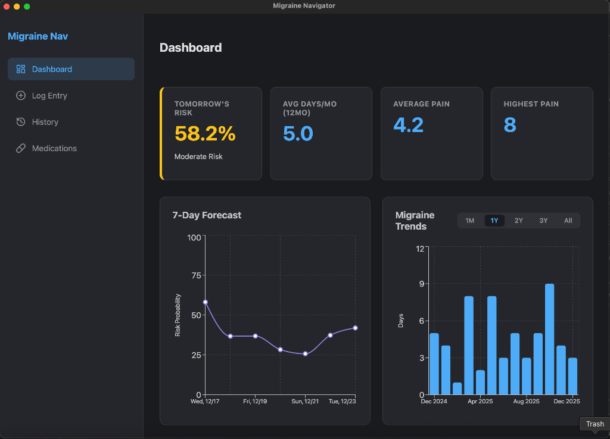
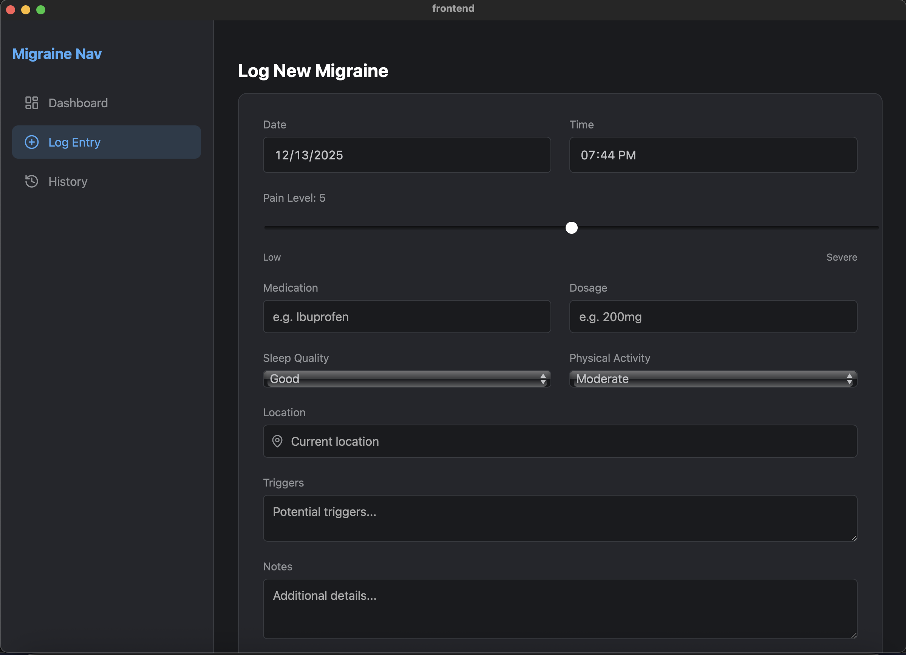
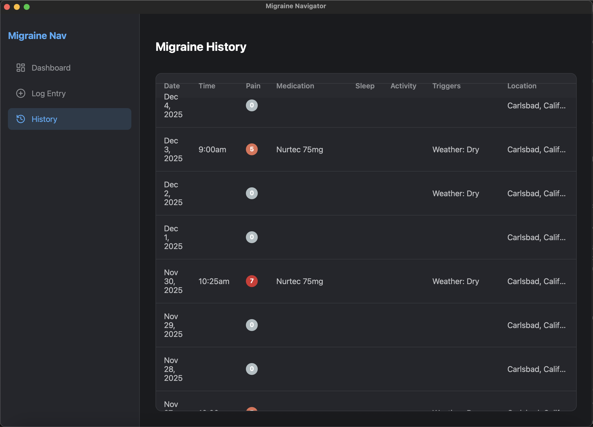

# Migraine Navigator

Migraine Navigator is a comprehensive tool designed to help users **track**, **analyze**, and **predict** migraine occurrences. 

> **Alpha v1.0 Update**: The application has been migrated from a legacy Python GUI to a modern **Desktop Application** powered by **Tauri**, **React**, and **FastAPI**.

> **Disclaimer:** This software and its outputs are for informational and educational purposes only and are not intended to diagnose, treat, cure, or prevent any disease. Always consult a qualified healthcare provider for medical advice.

## Features

- **Enhanced Dashboard:** 
    - **Live Prediction**: See your "Tomorrow Risk" based on weather forecasts and recent history.
    - **Smart Metrics**: Track "Avg Days/Month" and pain severity trends.
    - **Interactive Trends**: Filter by 1M (Severity View), 1Y, or Full History (Frequency View).
    - **Medication Analysis**: Consolidated view with time-based filters.
- **Detailed Logging:** 
    - Log Date, Time, Pain Level, Sleep Quality, Physical Activity, Triggers, and Location.
    - Standardized numeric inputs for consistent data tracking.
- **History Management:** 
    - Full searchable/sortable history table.
    - **Edit** and **Delete** capabilities.
- **Modern Architecture:** 
    - Built on robust SQLite database.
    - Fast and lightweight Desktop experience.

## Screenshots


*Real-time predictive dashboard with weather integration and trends analysis.*


*Streamlined data entry with standardized inputs.*


*Detailed log management and searching.*

## Installation

### Prerequisites
- **Python 3.10+**
- **Node.js 18+**
- **Rust** (for Tauri)

### Setup

1.  **Clone the Repository**
2.  **Backend Setup**:
    ```bash
    python -m venv .venv
    source .venv/bin/activate  # or .venv\Scripts\activate on Windows
    pip install -r requirements.txt
    ```
3.  **Frontend Setup**:
    ```bash
    cd frontend
    npm install
    ```

## Usage

To run the application in development mode, you need two terminals:

**Terminal 1: Backend API**
```bash
source .venv/bin/activate
uvicorn api.main:app --reload
```
*Runs on http://127.0.0.1:8000*

**Terminal 2: Frontend App**
```bash
cd frontend
npm run tauri dev
```
*Launches the Desktop Window*

## File Structure

```
Migraine Navigator/
├── api/                     # FastAPI Backend
│   ├── routes/              # API Endpoints (Entries, Analysis)
│   └── main.py              # Server Entry Point
├── frontend/                # React + Tauri Frontend
│   ├── src/                 # UI Source Code
│   │   ├── pages/           # Dashboard, LogEntry, History
│   │   └── App.jsx          # Main Router
│   └── src-tauri/           # Rust Backend (Window Management)
├── services/                # Business Logic Layer
├── data/                    # Database (migraine_log.db)
└── ...
```

## Testing

Backend tests are available to verify API functionality:
```bash
python -m unittest discover tests
```

## Future Roadmap (v1.2)
- **Packaging**: Building standalone installers (`.dmg`, `.exe`).

## License

Copyright © 2025 Aresh Tajvar. All Rights Reserved.

Unauthorized copying of this file, via any medium is strictly prohibited.
The software is proprietary and confidential.

## Acknowledgements

Special thanks to my neurologist, Dr. Jack Schim, for his guidance, wisdom, and moral support to pursue this project. Dr. Schim did not directly participate in development and this does not constitute an endorsement or medical advice.

- [Tauri](https://tauri.app/) - For the lightweight desktop framework.
- [React](https://react.dev/) - For the modern UI library.
- [FastAPI](https://fastapi.tiangolo.com/) - For the high-performance backend.
- [Recharts](https://recharts.org/) - For the beautiful data visualization.
- [Meteostat](https://dev.meteostat.net/) - For historical weather data.
- [Open-Meteo](https://open-meteo.com/) - For live weather forecasts.

## Author

- **Aresh Tajvar**
- **GitHub**: [github.com/AreTaj](https://github.com/AreTaj)
- **LinkedIn**: [linkedin.com/in/aresh-tajvar](https://linkedin.com/in/aresh-tajvar)
