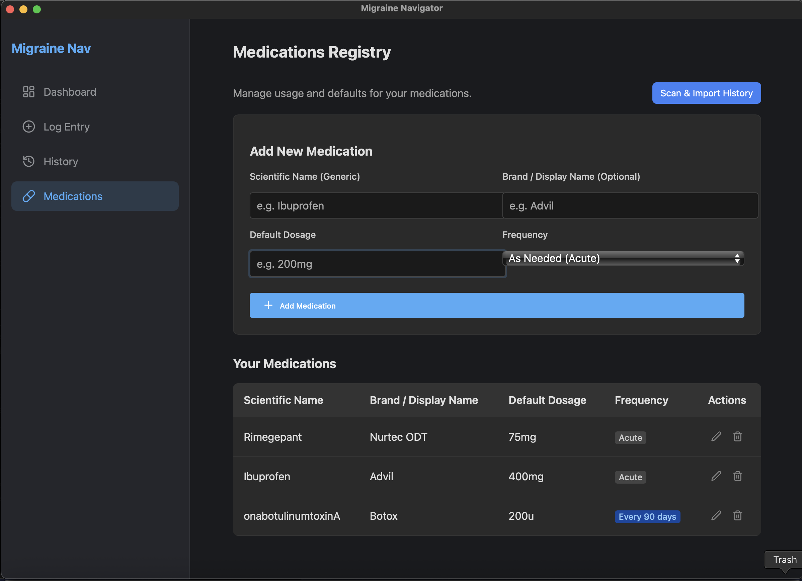
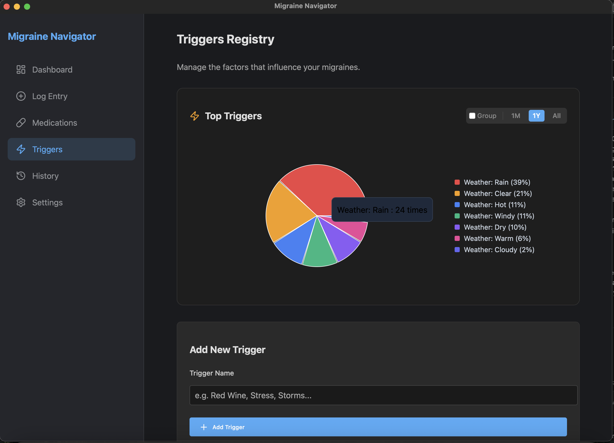
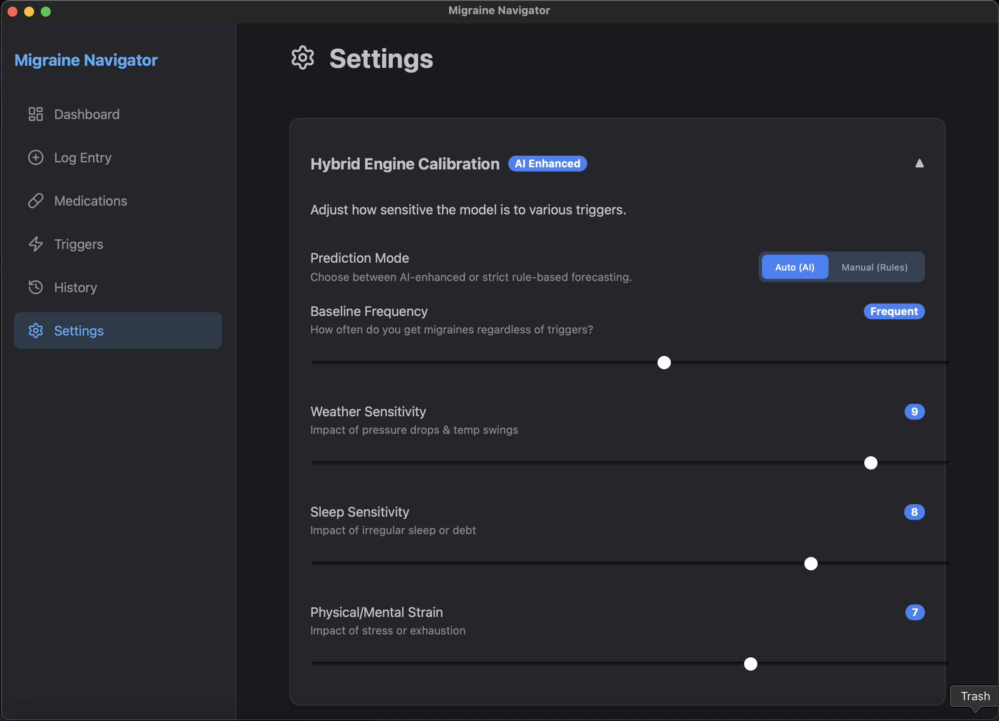

# Migraine Navigator

Migraine Navigator is a comprehensive tool designed to help users **track**, **analyze**, and **predict** migraine occurrences. 

> **Disclaimer:** This software and its outputs are for informational and educational purposes only and are not intended to diagnose, treat, cure, or prevent any disease. Always consult a qualified healthcare provider for medical advice.

## Features

- **Enhanced Dashboard:** 
    - **Live Prediction**: See your "Tomorrow Risk" based on weather forecasts and recent history.
    - **24-Hour Hourly Risk**: Granular hourly breakdown of risk intensity, calibrated to your daily prediction.
    - **7-Day Forecast**: Forward-looking probability chart with "Risk" scores to help plan your week ahead.
    - **Offline Resilience**: Automatically falls back to the most recent known weather data if the internet is down, with visual alerts.
    - **Smart Metrics**: Track "Avg Days/Month" and pain severity trends.
    - **Interactive Trends**: Filter by 1M (Severity View), 1Y, or Full History (Frequency View).
    - **Medication Analysis**: Consolidated view with pie chart visualization, extended color palette, and "Pain-Based" usage tracking (ignores pain-free days).
    - **Triggers Registry**: Centralized management for lifestyle factors (e.g., Food, Weather) with customizable categories, robust grouping/sorting, and cascading renames.
    - **Medication Management**: Dedicated registry for tracking doses, frequencies, and stock.
    - **Prediction Mode**: Toggle between "Auto (AI)" and "Manual (Rules)" forecasting engines.
- **Detailed Logging:** 
    - **Smart Geolocation**: IP-based location tagging for accurate weather correlation without intrusive permissions.
    - **Medication Management**: Dedicated registry for tracking doses, frequencies, and stock.
    - **Log Date, Time, Pain Level, Sleep Quality, Physical Activity, Triggers.**
- **History Management:** 
    - **Performance Optimized**: Date-based filtering (Last 7 Days, 30 Days, etc.) for instant loading.
    - **TimeZone Aware**: Intelligent date handling ensuring "Today" means *your* today, regardless of when you log.
    - Full searchable/sortable history table with **Edit** and **Delete** capabilities.
- **Modern Architecture:** 
    - Built on robust SQLite database.
    - **Reactive Caching**: Instant dashboard updates upon data modification, with 1-hour caching for stability.
    - Fast and lightweight Desktop experience (~190MB optimized DMG).
    - **Robust Sidecar Management**: Uses "Stdin Monitoring" (Dead Man's Switch) to ensure zero zombie processes.

## Screenshots

*Real-time predictive dashboard with weather integration and trends analysis.*

*Streamlined data entry with standardized inputs.*

*Detailed log management and searching.*

*Centralized registry for managing medication types, dosages, and frequencies (Acute vs. Preventative).*

*Manage and group lifestyle triggers with color-coding and categories.*

*Customize prediction sensitivity, theme preferences, and data management.*

## Technical Highlights

Migraine Navigator runs deeply personalized AI **locally on your device**.

### [Hybrid Prediction Engine](documentation/prediction_engine.md)
*   **Bayesian Heuristic Engine**: Provides immediate value for new users using calibrated sensitivity settings.
*   **Gradient Boosting ML**: Automatically takes over as your data grows to detect complex, non-linear patterns.

### [24-Hour Risk Engine](documentation/prediction_engine.md)
Uses a novel **"Truth Propagation"** technique where the daily ML prediction "anchors" a high-resolution heuristic curve, delivering granular hourly risk scores without requiring hourly user logs.

> [!TIP]
> **[Read the full Deep Dive on the Prediction Engine](documentation/prediction_engine.md)**

## Documentation
    
For deeper technical details:

*   **[Technical System Overview](documentation/technical_system_overview.md)**: Details the FastAPI/Tauri architecture.
*   **[Model Optimization Study](documentation/model_optimization_study.md)**: The "Perfect Storm" experiment (N=80,640 simulations).

## Installation

### Download (macOS)
1. Go to the [Releases](https://github.com/AreTaj/Migraine-Navigator/releases) page.
2. Download the latest `.dmg` file (e.g., `Migraine Navigator_0.2.5_aarch64.dmg`).
3. Drag the app to your Applications folder.

## Usage

**For Users:**
Launch "Migraine Navigator" from your Applications folder.

## Contributing

Interested in building locally or understanding the code structure?

*   See **[CONTRIBUTING.md](CONTRIBUTING.md)** for developer setup, file structure, and testing instructions.
*   See **[ROADMAP.md](ROADMAP.md)** for correct future plans.

## Changelog
See [CHANGELOG.md](CHANGELOG.md) for a detailed history of changes.

## License

Copyright © 2025 Aresh Tajvar.

This project is licensed under the **PolyForm Noncommercial License 1.0.0**.

*   **Personal & Educational Use**: You are free to download, run, and study this code for personal or educational purposes.
*   **Commercial Use**: Commercial use, redistribution, or monetization of this software—in whole or in part—is strictly prohibited.

This project serves as a technical portfolio piece and a "proof of concept" for future cross-platform development. For inquiries regarding commercial licensing or professional collaboration, please reach out via [LinkedIn](https://linkedin.com/in/aresh-tajvar).

See the [LICENSE](LICENSE) file for the full legal text.

### Why this License? (Developer Note)

As the sole author of Migraine Navigator, I have chosen a "Source-Available" (Non-Commercial) license rather than a standard Open Source license (like GPL or MIT).

**My Strategy:**

*   **Transparency**: I want to demonstrate that sophisticated AI can be fully effective entirely on-device. This codebase opens the "black box" on a **Privacy-First ML Architecture**—featuring a **Dual-Stage Hurdle Model** (GBDT), **Cyclical Temporal Encoding**, and purely local processing—proving that personal health data never needs to leave the user's machine to deliver powerful insights.
*   **IP Protection**: This desktop application is a "loss leader" intended to demonstrate the viability of the ML pipeline. I am retaining all commercial rights to ensure that future mobile adaptations (Cloud/SaaS) remain proprietary and protected from low-effort commercial clones.
*   **Integrity**: This license ensures that this portfolio piece remains a pure representation of my work and cannot be exploited by third parties for profit.

## Acknowledgements

Special thanks to my neurologist, Dr. Jack Schim, for his guidance, wisdom, and moral support to pursue this project. Dr. Schim did not directly participate in development and this does not constitute an endorsement or medical advice.

- [Tauri](https://tauri.app/) - For the lightweight desktop framework.
- [React](https://react.dev/) - For the modern UI library.
- [FastAPI](https://fastapi.tiangolo.com/) - For the high-performance backend.
- [Recharts](https://recharts.org/) - For the beautiful data visualization.
- [Open-Meteo](https://open-meteo.com/) - For live weather forecasts.

## Author

- **Aresh Tajvar**
- **GitHub**: [github.com/AreTaj](https://github.com/AreTaj)
- **LinkedIn**: [linkedin.com/in/aresh-tajvar](https://linkedin.com/in/aresh-tajvar)
