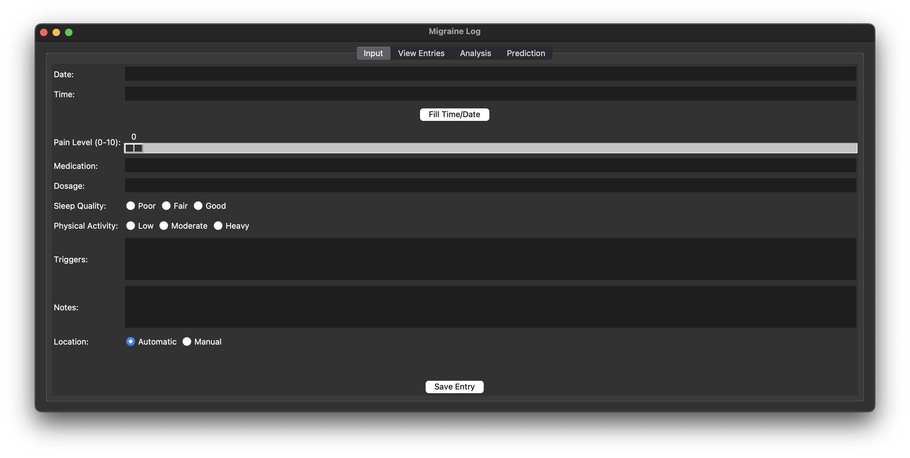

# Migraine Log

This project is a Tkinter-based GUI application for logging and analyzing migraine occurrences. It allows users to input migraine instance details, view logged entries, and perform analysis and predict future migraines based on machine learning algorithms.

## Features

- **Input Frame**: Allows users to input details about their migraines, including date, time, pain level, medication, dosage, triggers, notes, and location.
- **View Frame**: Displays the logged migraine entries in a tabular format.
- **Analysis Frame**: Provides graphical analysis of the migraine data, including migraine days per month, migraine days per year, and medication usage.
- **Prediction Frame**: Predicts the likelihood of a migraine based on the user's accumulated migraine frequency data, as well as current and historical weather data using a trained machine learning model.

## Requirements

The project requires the following Python packages:

- `pandas`
- `geocoder`
- `matplotlib`
- `pytz`
- `meteostat`
- `scikit-learn`
- `joblib`

These dependencies may be installed using the following command:

```sh
pip install -r requirements.txt
```

## Usage

1. **Run the Application**: Execute the `main.py` file to start the application.

    ```sh
    python main.py
    ```

2. **Input Data**: Use the "Input" tab to enter migraine instance details. Click the "Save Entry" button to save the data.

3. **View Entries**: Switch to the "View Entries" tab to see the logged entries in a table.

4. **Analyze Data**: Go to the "Analysis" tab to perform graphical analysis on the migraine data. Select the type of graph you want to display and click the "Analyze" button.

5. **Predict Migraines**: Use the "Prediction" tab to predict the likelihood of a migraine based on the input data and current weather conditions. Click the "Predict" button to see the prediction result.

## File Structure

- `main.py`: The main entry point of the application; all other frames are integrated here.
- `input_frame.py`: Contains the `InputFrame` class for inputting details.
- `view_frame.py`: Contains the `ViewFrame` class for viewing logged entries.
- `analysis_frame.py`: Contains the `AnalysisFrame` class for analyzing data.
- `prediction_frame.py`: Contains the `PredictionFrame` class for predicting migraines.
- `migraine_log.csv`: The CSV file where data is stored.
- `weather_data.csv`: The CSV file where weather data is stored.
- `combined_data.csv`: The CSV file where combined migraine and weather data is stored.
- `requirements.txt`: Lists the required Python packages and allows easy installation.

## Screenshots

### Input Frame


### View Frame
Cannot be shown for reasons of data privacy.


### Analysis Frame


### Prediction Frame


## Testing
To run the tests, use the following commad:

    ```sh
    python -m unittest discover tests
    ```

To run a specific test file, use the following command:
    ```sh
    python -m unittest tests.test_input
    ```
    Modify tests.test_{x} for each file in tests/

## License

This project is licensed under the MIT License - see the [LICENSE](LICENSE) file for details.

## Acknowledgements

- [Tkinter](https://docs.python.org/3/library/tkinter.html) for the GUI framework.
- [Pandas](https://pandas.pydata.org/) for data manipulation.
- [Matplotlib](https://matplotlib.org/) for plotting graphs.
- [Geocoder](https://geocoder.readthedocs.io/) for location services.
- [Pytz](https://pythonhosted.org/pytz/) for timezone handling.
- [Meteostat](https://dev.meteostat.net/) for weather data.
- [Scikit-learn](https://scikit-learn.org/) for machine learning algorithms.
- [Joblib](https://joblib.readthedocs.io/) for model serialization.

## Author

This project was created by Aresh Tajvar.

- **GitHub**: [github.com/AreTaj](https://github.com/AreTaj)
- **LinkedIn**: [linkedin.com/in/aresh-tajvar](https://linkedin.com/in/aresh-tajvar)

Feel free to reach out if you have any questions or suggestions!