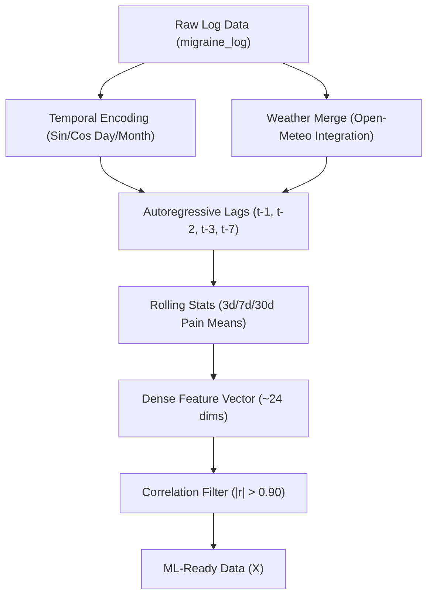
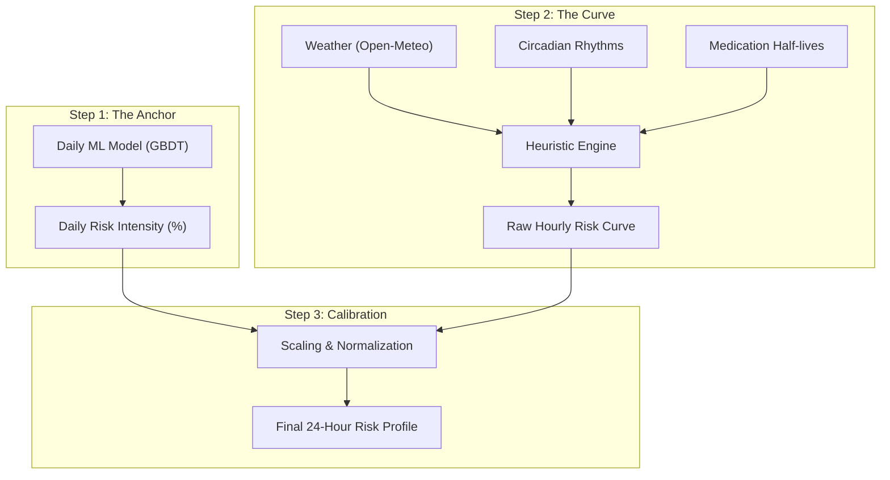
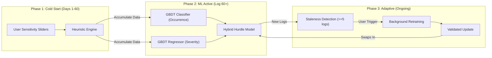

# Advanced Prediction Engine

Migraine Navigator employs a sophisticated **Hybrid Architecture** to solve the "Cold Start" problem inherent in pure ML systems.

## Hybrid Architecture

### 1. Bayesian Heuristic Engine (New Users)
Provides immediate, personalized predictions from Day 1. It bridges the "Cold Start" gap by using your calibrated settings (sensitivity to Weather, Sleep, Stress) until sufficient history exists.

### 2. Gradient Boosting ML (Established Users)
Automatically takes over once enough data is collected (>60 logs) to detect complex, non-linear patterns unique to your biology using Gradient Boosting Decision Trees (GBDT).

### 3. Feature Selection (Pre-Training Filter)
Before training, a **Correlation Matrix Filter** removes redundant features to improve model stability and interpretability:
*   Any pair of features exceeding Pearson $|r| > 0.90$ is identified. The feature with more missing values is dropped.
*   **Deterministic tie-breaking**: When missing value counts are equal, the alphabetically-last column name is dropped, ensuring identical results across all environments.
*   **Small-dataset guard**: Automatically skipped when $N < 30$ to avoid spurious correlations for new users.
*   Applied *inside* each cross-validation fold to prevent data leakage into the test set.

### Feature Engineering Pipeline


## 24-Hour Risk Engine (Truth Propagation)

Training a pure ML model for hourly predictions requires unrealistic, massive labeled datasets with hourly log entries. We solve this with a 3-step hybrid approach:



*   **Step 1 (The Anchor)**: The powerful and proven Daily ML Model predicts the overall risk intensity for the day (e.g., "69% Risk") based on deep historical patterns.
*   **Step 2 (The Curve)**: A granular Heuristic Engine calculates the relative risk for every hour based on circadian rhythms, weather shifts (Open-Meteo), and medication half-lives.
*   **Step 3 (The Calibration)**: The hourly curve is mathematically scaled so that its peak matches the Daily ML "Truth". 

**Result**: This provides the best of both worlds: the **accuracy** of the ML model with the **temporal resolution** of the heuristic engine.

## Enhanced Triggers
The engine now accounts for detailed meteorological factors:
*   Rain (>0.5mm)
*   High Humidity (>70%)
*   Pressure Instability (Rapid drops or spikes)

## Model Lifecycle

The prediction system evolves with the user across three distinct phases:



```
Day 1–60 (Cold Start)     Log 60+ (ML Active)     Ongoing (Adaptive)
─────────────────────     ──────────────────────  ──────────────────────
Heuristic Engine     →    GBDT takes over      →   Periodic Retraining
(sensitivity sliders)     (detects your unique      (≥5 new logs since
                           patterns via GBDT)         last training run)
```

1.  **Cold Start**: The Heuristic Engine provides immediate value using onboarding sensitivity settings.
2.  **ML Takeover**: Once ≥60 logs exist, the Gradient Boosting model trains on your complete history and begins delivering personalized predictions.
3.  **Adaptive Retraining**: As you continue logging, staleness is detected automatically. The Dashboard shows a "Model Update Ready" notification. One tap triggers a background retrain — the old model stays active until the new one is ready and validated.

> The model you have on Day 365 is fundamentally more accurate than the one you had on Day 60, because it has learned from a full year of *your* personal patterns.
